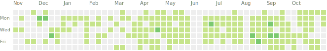

# GitHubChart (The Rusty Version)

Generates an SVG of your GitHub contributions:



## Fork

This is forked from [githubchart](https://github.com/akerl/githubchart) and ported from Ruby to Rust. It does not provide 100% of the same functionality, but it does generate a similar SVG.

## Usage with `cargo`

If you have Rust installed and are familiar with cargo, you can install and run this directly:

```sh
cargo run -- output.svg -u frytg
```

This compiles and runs the program directly (using dev profile and debug symbols). This would also be the command when developing locally.

To modify the color scheme used, you can provide `-c SCHEME`. For example, `cargo run -- output.svg -u frytg -c halloween` uses GitHub's halloween colors.

Use `cargo fmt` to format the code.

## Usage with binary

Alternatively, you can download a release binary from the [releases page](https://github.com/frytg/githubchart-rust/releases) and run it directly:

```sh
./githubchart output.svg -u frytg
```

## Build

You can build a release binary with:

```sh
cargo build --release
```

[`Cargo.toml`](./Cargo.toml) is configured to optimize for size.

Test the binary with:

```sh
./target/release/githubchart release.svg -u frytg
```

## License

This `githubchart-rust` fork (like the upstream repo) is released under the MIT License. See the bundled [LICENSE](./LICENSE) file for details.
